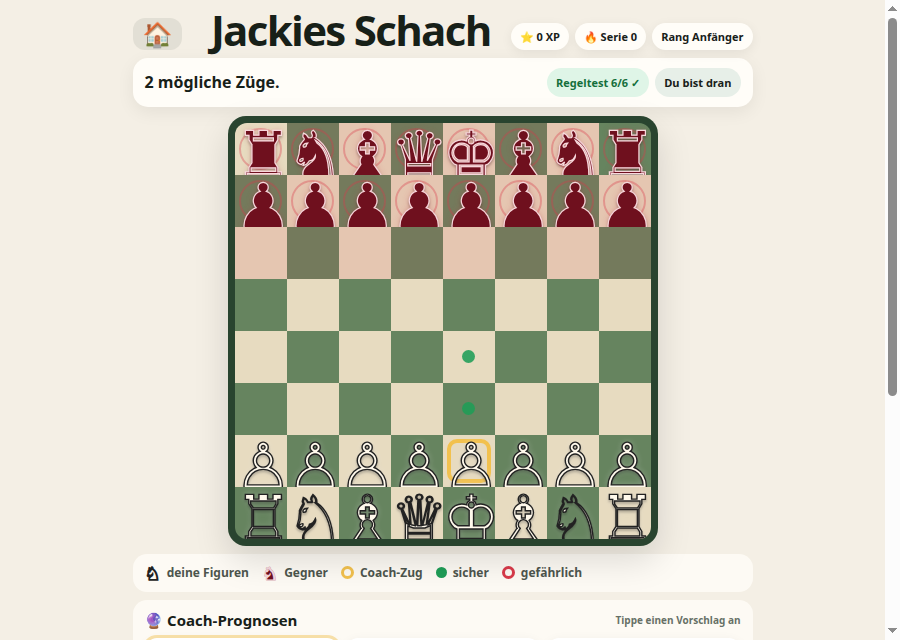

# ♟️ Jackies Schach

**Full FIDE rules with a coach that marks the safe squares (German)**

[](https://jacks-games.github.io/chess/)




> 🇩🇪 **This game's interface is in German**, unlike the other four. It was built first, for the
> same child, at home rather than for school.

## What this is

A full chess implementation with a **coach layer aimed at a beginner who cannot yet see danger**.
All the real rules are enforced — legal moves only, check, checkmate, stalemate, castling, en
passant, promotion — and the engine runs a self-test of its own rule set on load, shown as the
*Regeltest* badge.

What makes it a children's game is the annotation. Before committing to a move, the board marks
every destination square as safe or attacked, and the coach offers up to three ranked ideas
together with the opponent's likely reply. The habit it is building is "what happens next",
which is the step most beginners skip.

## 🎮 How to play

### 1️⃣ &nbsp; Tap one of your pieces ♙
Only your own pieces respond.

### 2️⃣ &nbsp; Read the dots

| | |
|---|---|
| 🟢 | Safe square — nothing can capture you there |
| 🔴 | Dangerous — something is attacking that square |
| 🟡 | A move the coach likes |

### 3️⃣ &nbsp; Tap where you want to go
The piece moves and the opponent replies.

### ⭐ &nbsp; XP and streaks
Good moves earn stars; consecutive wins build a streak 🔥 and a rank.

## 🧑‍🏫 The coach

Up to three suggestions, ranked ⭐ / ⭐⭐ / ⭐⭐⭐, each with the reply the opponent is most likely
to make. A child can guess first and then check — the suggestions can also be turned off
entirely.

## ⚙️ Settings

| | |
|---|---|
| 💪 **Stärke** | opponent strength |
| 💡 **Tipps** | coach suggestions on or off |
| 🐢 **Gegnerzug** | how quickly the opponent replies |

## 🎯 What it practises

- 🧠 &nbsp; Looking one move ahead
- 👀 &nbsp; Noticing what is under attack before moving
- ♟️ &nbsp; The complete rule set, including the parts beginners' apps usually skip

## ⚙️ Notable details

- Threefold repetition and the fifty-move rule can be **claimed**; fivefold repetition and the
  seventy-five-move rule end the game automatically.
- Over-the-board tournament conventions — touch-move, clocks, an arbiter — are deliberately not
  modelled.
- XP, best score and streak are kept in `localStorage`.

## 🎈 The other games

| Game | What it is | |
|---|---|---|
| 📖 [**Jack's Words**](https://github.com/jacks-games/words) | Hear a word, build it from letter tiles, then read it in a sentence | [▶ play](https://jacks-games.github.io/words/) |
| 🥅 [**Jack's Match**](https://github.com/jacks-games/match) | Tell real words from decodable nonsense words, then spell by ear | [▶ play](https://jacks-games.github.io/match/) |
| ✏️ [**Jack's Letters**](https://github.com/jacks-games/letters) | Finger-trace all 26 lowercase letters in the correct stroke order | [▶ play](https://jacks-games.github.io/letters/) |
| 🔢 [**Jack's Numbers**](https://github.com/jacks-games/numbers) | Count, add and subtract with footballs — to 10, then to 20 | [▶ play](https://jacks-games.github.io/numbers/) |
| 🍎 [**Jack's Apples**](https://github.com/jacks-games/apples) | Trace 1–20, then fill the missing numbers into the apple grid | [▶ play](https://jacks-games.github.io/apples/) |
| 👀 [**Jack's Sight Words**](https://github.com/jacks-games/sight-words) | The twenty most common English words on big cards — tap one and hear it read out | [▶ play](https://jacks-games.github.io/sight-words/) |
| ♟️ [**Jackies Schach**](https://github.com/jacks-games/chess) | Full FIDE rules with a coach that marks the safe squares (German) | [▶ play](https://jacks-games.github.io/chess/)  👈 **this one** |

All seven on one start page: **[jackbenn.ing](https://jackbenn.ing)**

## 🛠 Built like this

Every game in this organisation is **one self-contained `index.html`** — no build step, no
framework, no package manager, no analytics, and no network calls once the page has loaded.
That is a deliberate constraint: a game a child depends on should still work in five years,
and a parent should be able to read the whole thing in one sitting.

- **Speech** — the browser's Web Speech API, preferring a British English voice. It always
  waits for a tap first, because Chrome and iOS block audio without user activation.
- **Progress** — kept in `localStorage` on the device. Nothing is collected, sent or stored
  anywhere else.
- **Made for** an iPad mini in either orientation: finger-sized targets, no hover-only
  interactions, `prefers-reduced-motion` respected.

Run it locally:

```bash
python3 -m http.server 8000
```

The start page at [jackbenn.ing](https://jackbenn.ing) is built from
[google814/Jack](https://github.com/google814/Jack), which is the source of truth. The repos
in this organisation are copies kept in step by `tools/sync-game-repos.sh` in that repo, so
each game also has its own page and its own link.
